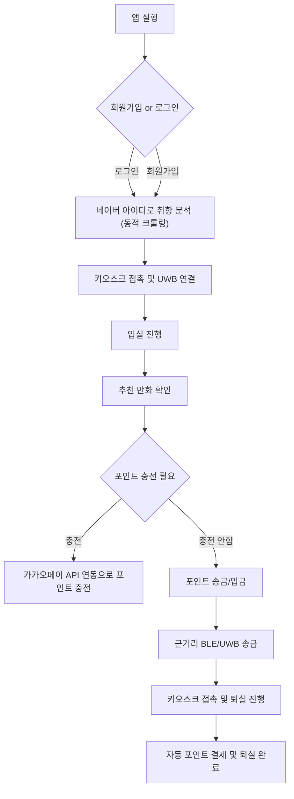

# CartoonTime
CartoonTime은 Alltime에서 제공하는 다양한 기능을 포함한 안드로이드 앱입니다. BLE(Bluetooth Low Energy), UWB(Ultra-Wideband), FCM(Firebase Cloud Messaging), MQTT(Message Queuing Telemetry transport) 등을 활용하여 다양한 네트워크 및 기기 간 상호작용을 지원하며, 사용자에게 편리한 UI/UX를 제공합니다.

## 소개


- 소중한 시간을 아껴주고
- 개인정보를 확실하게 지켜주고
- 관리 자동화로 부담을 줄여주고
- 어느 단말에서도 쓸 수 있는

위와같은 특징을 가진 저희 서비스는 고객과 사업자 모두에게 편리함을 제공하기 위한 통합 솔루션 서비스입니다.

## 기능

## 기능

### 간편 회원가입

<div style="display: flex; align-items: center;">
    <div style="flex: 1; text-align: center;">
        
    </div>
    <div style="flex: 2; text-align: left;">
        전화번호 하나로 진행되는 회원가입은 블록체인을 활용해 더욱 안전하게 관리됩니다.
    </div>
</div>

### 입/퇴실

<div style="display: flex; align-items: center;">
    <div style="flex: 1; text-align: center;">
        
        
    </div>
    <div style="flex: 2; text-align: left;">
        휴대폰의 다양한 센서를 활용해 모션을 인식하고 특정 모션으로 UWB를 활성화 한 후 키오스크와 연결해 자동으로 입퇴실을 진행합니다. UWB 기능이 꼭 필요하기 때문에 만약 단말기가 UWB를 지원하지 않는다면 애플리케이션을 이용하실 수 없습니다.
    </div>
</div>

### 충전

<div style="display: flex; align-items: center;">
    <div style="flex: 1; text-align: center;">
        
    </div>
    <div style="flex: 2; text-align: left;">
        카카오페이 API를 연동하여 쉽게 포인트를 충전할 수 있도록 구현하였습니다. 이 또한, 블록체인 기술을 활용하여 간편함을 추구하면서 보안을 강화하였습니다.
    </div>
</div>

### 송금/입금

<div style="display: flex; align-items: center;">
    <div style="flex: 1; text-align: center;">
        
        
    </div>
    <div style="flex: 2; text-align: left;">
        UWB와 BLE를 사용하여 근거리에서 신뢰성있는 송금 기능을 구현하였습니다. 
    </div>
</div>

### 추천, 실내 내비게이션

<div style="display: flex; align-items: center;">
    <div style="flex: 1; text-align: center;">
        
    </div>
    <div style="flex: 2; text-align: left;">
        네이버 웹툰을 동적 크롤링하여 사용자의 취향을 분석합니다. 특정 웹툰의 전체 회차수 대비 읽은 회차수를 통해 점수를 부여하고 이를 활용합니다.
    </div>
</div>

### 각속도, 자기계, 자이로 센서

휴대폰에 포함된 다양한 센서를 사용하고 있습니다.
- 각속도 센서를 사용해 모션을 인식하고 UWB 서비스 기능을 활성화합니다.
- 센서 전부를 사용해 실내에서 사용할 수 있는 내비게이션 서비스를 제공합니다.

```kotlin
// 센서를 활용해 좌표계, 방향을 특정함

fun calculateTargetDirection(current: Location, target: Location): Float {
        // 좌표계: X의 증가 방향이 아래쪽, Y의 증가 방향이 왼쪽
        //val dx = current.x - target.x  // X의 증가 방향이 아래쪽이므로 방향 반대로 계산
        val dx = -(target.x - current.x)
        val dy = target.y - current.y  // Y의 증가 방향이 왼쪽이므로 방향 반대로 계산

        // 각도를 계산하고, 360도를 기준으로 보정
        return Math.toDegrees(atan2(dy.toDouble(), dx.toDouble())).toFloat()
    }

    private fun calculateOrientation() {
        // 가속도계와 자기계 데이터를 사용하여 방향 계산
        val rotationMatrix = FloatArray(9)
        val inclinationMatrix = FloatArray(9)
        val orientationValues = FloatArray(3)

        if (SensorManager.getRotationMatrix(rotationMatrix, inclinationMatrix, accelerometerValues, magnetometerValues)) {
            SensorManager.getOrientation(rotationMatrix, orientationValues)
            val azimuth = Math.toDegrees(orientationValues[0].toDouble()).toFloat()
            _direction.value = azimuth
        }
    }
```

## 구성

### 프레임워크


### ERD


### 흐름도

